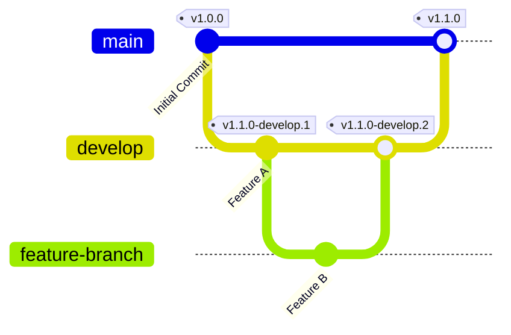

# WeakSpotter

<div align="center">
    <a href="https://sonarqube.devops-tools.apoorva64.com/dashboard?id=weakspotter-back">
        
    </a>
    <a href="https://sonarqube.devops-tools.apoorva64.com/dashboard?id=weakspotter-front">
        
    </a>
    <a href="https://app.fossa.com/projects/git%2Bgithub.com%2FWeakSpotter%2FWeakSpotter?ref=badge_shield&issueType=license">
        
    </a>
</div>

<div align="center">
    <a href="https://argocd.weakspotter.ozeliurs.com/applications/weakspotter-production">
        
    </a>
    <a href="https://argocd.weakspotter.ozeliurs.com/applications/weakspotter-staging">
        
    </a>
</div>


Description

## Usage

You can use the `docker-compose.yml` file to run the application in a containerized environment.

```bash
docker compose up -d && docker compose logs -f
```

And then access the application at `http://localhost:3000`.

## Contributing

### Prerequisites & Running Locally

To run this project locally, you need to have Docker installed.

This project leverages `docker compose watch` to facilitate development for both the frontend and backend. This tool automatically rebuilds the images and restarts the containers whenever you make changes to the code.

To get started, simply execute the following command:

```bash
docker compose watch
```

This will start the project in development mode, allowing you to see your changes in "real-time".

### Branching Strategy

This repository follows the a simple branching strategy:

- `main`: Main branch for the project, do not directly commit to it brother, don't break shiet.
- `develop`: Unstable branch for development.
- `litteraly-anything-else`: Do your shiet here before merging to `develop` or commit directly to `develop` if you're feeling lucky.



### Commit Standards

This repository follows the [Conventional Commits](https://www.conventionalcommits.org/en/v1.0.0/) standard for commit messages.

Please use it. **Please.**

### Project Structure

- `backend/`: Contains the FastAPI application.

  - `app/main.py`: Entry point for the FastAPI application.
  - `Dockerfile`: Docker configuration for building the backend image.
  - `requirements.txt`: Python dependencies required by the backend.

- `frontend/`: Contains the React application.

  - `public/index.html`: HTML template for the React application.
  - `src/`: React source files including `App.js` and `index.js`.
  - `Dockerfile`: Docker configuration for building the frontend image.
  - `package.json`: NPM dependencies and scripts for the frontend.

- `.gitignore`: Specifies intentionally untracked files to ignore.
- `docker-compose.yml`: Defines and runs multi-container Docker applications.
- `README.md`: Documentation about this project.

### Automation & Releases

We use semantic relase to automate the versioning and release process. We do a pre-release on every commit to `develop` and a release on every commit to `main`.

We also use sonarqube to analyze the code quality of the project. You can access the sonarqube dashboard [here](https://sonarqube.devops-tools.apoorva64.com).

## License

This project is licensed under the MIT License.

## Other

- [Github Repo Tracker](https://githubtracker.com/WeakSpotter/WeakSpotter)
